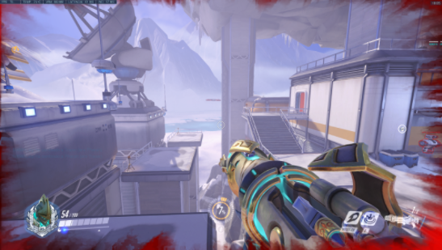
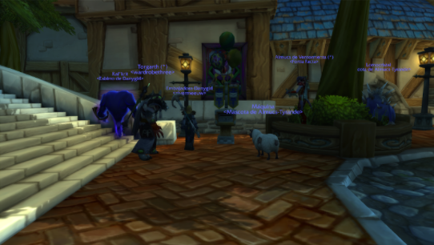
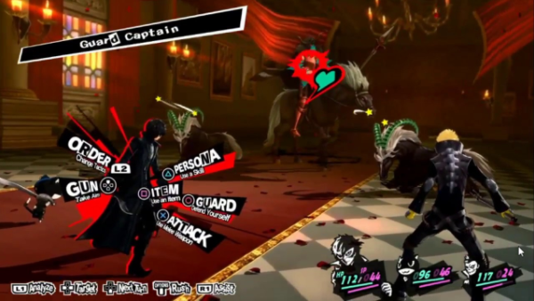

# What is a UI?

UI can be defined as that which is interposed between the player and the game itself allowing a relationship between both, or in other words, the interface is the part of the game that is always present in video games in one way or another helping the player providing information at all times.
A good use of it implies the difference between feeling that you move a character or that you press a key, that is why it must be robust and powerful but as subtle as possible in a way that facilitates the immersion of the player in the game.

 + **Interface objective**: to give the player the ability to control the gaming experience at all times, therefore it has to be easy to learn and use.
 + **Generally, it must**: guide the player towards the objectives, be intuitive, beautiful, fluid, predictable, influential...
 
# UI types and how they are executed in the market

+ **Diegetic**: the elements of this type of interface exist within the game world so that the player and the character can interact with them through visual, audible or tactile means.
Well-executed elements of this type of interface enhance the narrative experience for the player, providing a more immersive and integrated experience.

  + *Splatoon 2: Octo Expansion -> Main menu*
    + The main menu allows level selection, viewing conversation as if it were a chat, viewing collectibles or the same options all happens within the same game, making the character truly observe everything at the same size as the player appreciates it. 
    + In addition, a small extra detail that this menu has is that the player when moving the joystick to change the level or option, makes the character also move the joystick that he has in his hand, making this menu immerse the player more when he controls it.
    
    
    
  + *Persona 5 Strikers -> Third Eye*
    + The game uses its third eye to highlight enemies and their level, see nearby treasures and see the places which the player can stand to wait to attack.
    
      This makes the player and the character see the same thing, since the accompanying characters when observing the actions that they can do will warn the player about it.
      
    

+ **Goal**: Sometimes ui elements don't belong in the physical world of the game, but they can still maintain the narrative of the game.
  
  + *Overwatch -> Blood*
    + In this case, when the player takes enough damage to have 25% of their life left, the screen will fill with blood, implying that the player is losing life.
      
    
     
  + *Xenoblade Chronicles 2 -> Special Attack*
    + In certain moments of the combat, the game will show a sequence of buttons while the characters make a special move which will do more damage than a normal one.
    + At this moment the game warns when and which buttons the player must press so that the character can execute the movement correctly, if the player fails at any time, this movement will be choppy and the characters will not finish executing the movement.
      
    
    
+ **Spatial**: used when it is necessary to break the narrative to provide the player with more information than the character should know. It still belongs to the physical world of the game to help immerse the player and avoid having to break the experience by jumping to the menu screens. The more they follow the fictional rules of the game, the more they can help to immerse the player.

  + *Tom Clancy’s Splinter Cell -> Mechanics in the atrezzo*
    + The game teaches the player the simple mechanics to survive, for example, moving and covering, but putting the texts of the tutorial in the props of the level.
      
    
    
  + *World of Warcraft -> Players name*
    + This shows the player the names of each player around him so that he does not have to click on them and know who each person is.
      
    

+ **Non-diegetic**: These elements are free to be completely removed from the narrative and physical world of the game and can adopt their own visual treatment, albeit often influenced by the art direction of the game.
  These types of UI are usually typical of RPGs.

  + *Final Fantasy VII -> Combat HUD*
    + The game shows the information necessary to play in this mode, that is, what character you can use, what movement you are going to make, the life they have, etc., and although it has an artistic style similar to that of the game, it is not part of the game. world of the game nor of the narrative of this.
      
    
    
# Types of RPGs and what are different from them

Although RPGs are a very specific genre in the world of video games, there are different variants of these, each with its peculiarities and differences, of which we will name some of these:

+ **Turn-based combat**: The style most used by the main JRPGs on the market, such as Pokémon, the classics Final Fantasy, Dragon Quest, Shin Megami Tensei, Persona ... It is a system in which the player moves his character as a representative of the group in a mapping and he enters with his companions in a combat screen where the actions are decided in a menu and the speed of each participant is what decides their turn of action.

  These games, in general, when you travel the world, there is usually little or no data in the interface, so that players can appreciate the props of the world and contemplate it.
  
  
  
  On the other hand, when the general menus are opened they are usually very simple, although showing a lot of visual content, so that the player will have the image of what that menu action does in his head.
  
  
  
  While when in combat, the data of life and stamina of each player's usually shows some subtle way with the image of the character or name in a particular order: most important character to minor character, starting always with the protagonist and ending with the last member of the group.
  
  In addition, it usually shows the life of a bar of a green or bluish color, implying that the player can be calm since they have a lot or enough life. In case of having little, these usually turn a reddish tone and usually warn with some type of sound.
  
  
  
+ **ARPG - Action RPG**: These are titles in which we usually manage a character that we can move freely to fight against the enemies that appear on the stage. Some of these examples would be Kingdom Hearts, The Elder Scrolls, The Witcher, etc.

  In this case, being a game that does not have any transition to combat, it usually works with a very standard UI model so that it works both when you are fighting and when you are not, showing life, the map, the equipment that is carried and, in some cases, the combat tray.
  
  
  
  It should be noted that in some cases, when the player enters combat, some element of the interface usually changes some element of the interface, be it that the bar appears constantly, that the character changes pose, that the action bar changes to reddish hue, etc.
  
  

+ **SRPG - Strategic RPGs**: In general, this subgenre is usually the one that bears the most similarities to board RPGs, dividing the scenarios into squares, allowing us to handle large groups and giving each unit a certain mobility that can be affected by terrain accidents.

  This type of RPGs, represented mainly by series such as Shining Force, Fire Emblem, Final Fantasy Tactics or Disgaea.

  Regarding the composition of the interfaces of these in combat, it usually shows the board in a kind of grid and allows the player to know which squares both the player and the opponent can move during their turn.

  

  On the other hand, this interface usually also shows the names of the characters, the life of which it has, both visually and in an extended way once it is about to attack.

  In addition it also shows in a simple way the percentages of success, damage and critical, as well as the same data of the rival.

  On the other hand, these menus usually let the player change weapons quickly by pressing a button on the gamepad.

  

# What is a UX?

Before continuing, we must clarify that it is a User Experience.
User Experience, by definition, "is what a person perceives when interacting with a product or service", or in other words and referring to our topic, every good interface must be useful, usable and desirable, making the user feel satisfied, happy and delighted.

It should be said that unlike usability, which is present in the foundations of developing a good interface, it tries to make the user capable of doing a certain amount of things thus preventing errors in it, while UX seeks to please the user with your organization and information of things.

Here are 2 exemples of a good and a bad thing to do in a combat interface referring to the UX part:

### Good things to do

In Persona 5, when the combat start it appears the interface shown below appears. It does a number of things well done:

+ Mark each action that the player can do in an understandable and clear way.
+ Show each player's turn in a dynamic, attractive and clear way.
+ Show the target that you are going to attack before executing the action.

### Bad things to do

In Persona 3 Portable, when the combat start it appears the interface shown below appears. It does a number of things done poorly:

+ The action to be taken by the player is not understood.
+ It is not known which character is being controlled at this time.
+ There is no difference which can be the life bar and the stamina bar.
+ It does not mark which character is going to attack before executing the action.
+ It is not understandable what the faces they show next to the characters mean.

# How we will organize our own interface and menus

Having acquired and analyzed all the above knowledge, we are now able to design our own interfaces. Knowing that our game must be a type of **turn-based combat**, in general we will have these interfaces:
+ *In combat* interface, which will contain all our stats and will allow us to execute a movement at the same time that it will inform about the movements made by the player or the enemy.

  In general, this interface will contain 5 options, attack, which will allow the player to attack, defend, which will allow the player to defend himself, but will also receive a lower amount of damage, skills, menu in which it allows the player to use a special ability, items, menu which will allow the player to use a regenerating potion of life or special points, among other objects such as to allow when playing to have more attack or defense for a few turns, run, which will allow the player to flee from the battle, it should be noted that this menu will **generally** not be available in boss fights.

  

+ *Out combat* interface, which will inform about the life that the player and his teammates have at all times. This may have a minimap which will guide the player to their next destination.

  It should be noted that this interface or some part of this interface may not be present in the game being developed.

+ General menu *out combat*, which will show all the stats of the characters in an expanded way and will allow the player to navigate through a series of submenus that would generally be classified as follows:
  + **Items**: Menu which will appear all the objects that the player carries. It will have 2 submenus within this same if it requires it, which would be:
    + **Objects**: Objects which the player can use at any time and are consumable, therefore, they are spent. To get back to them, the player must buy them, find them in the world or defeat enemies.
    + **Key objects**: Important objects to advance in the history of the game. If the player does not have any of these objects, it will be impossible for him to continue advancing. Also, these items are non-consumable, unique, and there are usually not many of them.

    

  + **Equipment**: Menu in which it will allow to change the weapons and equipment of each member of the group.
  + **Attributes / Stats**: Menu which will provide detailed information on each life value, special points, attack, defense, speed, skill and luck. These can vary depending on the game that is played.

    In addition, it will also inform if the player has an alteration in his states, be it that he is poisoned or that he has a buff when wearing a specific equipment.

    
    
  + **Map**: Menu which shows the map in full screen with each place in which the player can go, in addition to its position and the destination to which it must arrive.
    It should be noted that in some cases this can show the position of enemies or non-playable characters.
  + **Settings**: General menu which will allow the player to change some game settings, for example graphic quality, volume or controls.

    
    
# Mapping the controls in the interface and menus

Given the above, I will show you how the controls should be for both the computer and the controls when it comes to navigating the menus of your game.

It should be noted that the controls will share functions between menus and in-game controls, they can also be configurable and with which the ones that I am going to show you right now may not be definitive in some of your games:

### Keyboard

+ Having used **WASD** as the character movement controls, it is recommended that **W** and **S** be used to navigate the menus as well, with **W** being to move the menu selection **up** and **S** to move the menu selection **down**.
+ While **E**, **Enter** and **Space**, used to interact with the environment, can be used to **select** a menu and thus enter the next submenu or give it to accept. These can vary making only 1 of these keys work to do the named action.
+ Finally, **Escape**, will be used as **cancel** or **go back**, while when the player is in the main menu of the submenus, it will close completely and return to the game.

### Gamepad

+ Having used the **left stick** and the **d-pad** as the movement controls of the characters, it is recommended that these are also used to navigate through the menus, with the **up d-pad button** and **up left stick** above to move the menu selection **up** and **down d-pad button** and **down left stick** to move menu selection **down**.
+ While **A**, used to interact with the environment, can be used to **select** a menu and thus enter the next submenu.
+ **B**, will be used as **cancel** or **go back**, while when the player is in the main menu of the submenus, it will close completely and return to the game.
+ Finally, the **Menu button** on the Xbox One controller can be used to close the menu completely regardless of which submenu it is in and thus **return** to the game immediately.

# Documentation Links

+ [Class presentation](https://github.com/alexgesti/RPGUIMenus/blob/main/docs/presentation.pdf) in PDF.

**Documentation**
+ [User interface design in video games - English](https://www.gamasutra.com/blogs/AnthonyStonehouse/20140227/211823/User_interface_design_in_video_games.php#:~:text=User%20interface%20design%20in%20games,in%20a%20novel%20or%20film).
+ [Subgenres in the RPG genre - Spanish](http://www.destinorpg.es/2014/05/los-subgeneros-en-el-genero-rpg.html).
+ [What is: UX and UI - Spanish](https://blog.acantu.com/que-es-ux-y-ui/#:~:text=UX%20es%20aquello%20que%20una,con%20un%20producto%20o%20servicio.&text=Es%20muy%20com%C3%BAn%2C%20que%20el,con%20lo%20que%20se%20interact%C3%BAa).
